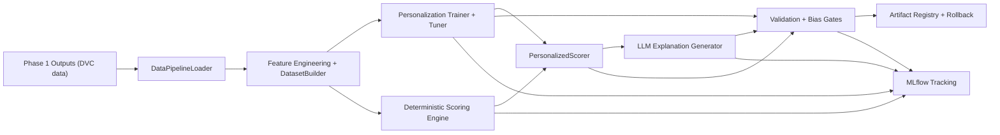
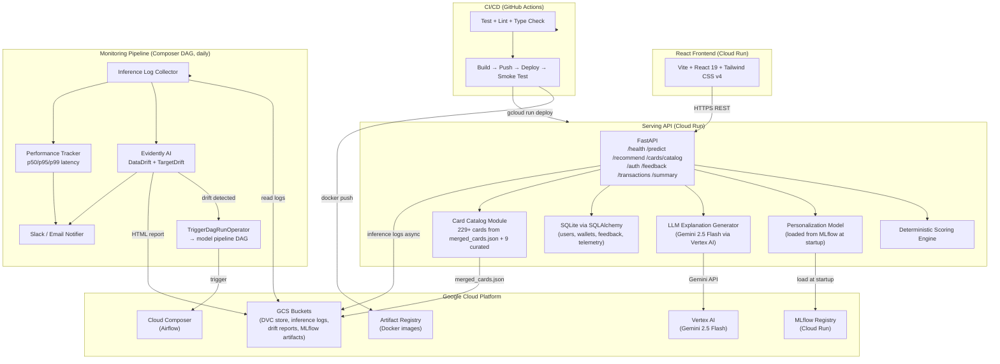

# RewardSense

**Cost-aware, explainable credit-card rewards platform with a full three-phase MLOps lifecycle:**

- **Phase 1:** Data pipeline (ingestion, transformation, validation, anomaly detection, versioning, monitoring)
- **Phase 2:** Model pipeline (deterministic scoring, personalization ML, LLM explainability, fairness, CI/CD, registry)
- **Phase 3:** Production deployment & platform expansion (Cloud Run serving API, React frontend, automated CD, model monitoring, drift-triggered retraining, user auth, feedback capture, LLM telemetry)

> **Presented at the Google Cambridge office.** Demo video submitted.

RewardSense solves credit-card reward optimization: recommending the best card per transaction, adapting by user behavior, and generating transparent explanation output for users and reviewers.

**Repository:** [github.com/avadharj/rewardsense](https://github.com/avadharj/rewardsense)

---

## Table Of Contents

1. [Phase 1: Data Pipeline](#phase-1-data-pipeline)
2. [Phase 2: Model Pipeline](#phase-2-model-pipeline)
3. [Phase 3: Production Deployment & Platform Expansion](#phase-3-production-deployment--platform-expansion)
4. [Quick Navigation: Key Files](#quick-navigation-key-files)

---

## Phase 1: Data Pipeline

This section contains the complete Phase 1 data-pipeline documentation and implementation details.

### 1. End-To-End Architecture

#### System Vision

RewardSense is a production-style MLOps data platform that ingests credit card offer data from web scrapers, REST APIs, and synthetic generators, then processes it through a multi-stage pipeline orchestrated by Apache Airflow on GCP Cloud Composer. The pipeline cleans, validates, feature-engineers, and versions the data — producing ML-ready feature CSVs, quality reports, anomaly alerts, and performance dashboards.

#### Pipeline Stages Overview

The weekly Airflow DAG (`rewardsense_data_pipeline`) runs **every Sunday at 6:00 AM UTC** and executes **6 sequential task groups**:

```
pipeline_start → Ingestion → Preprocessing → Quality → Anomaly Detection → Versioning → Reporting → pipeline_end
```

| Stage | Purpose | Key Technology |
|---|---|---|
| **Ingestion** | Acquire card data from scrapers, APIs, and generate synthetic data | Web scraping, REST APIs, generators |
| **Preprocessing** | Clean, validate, feature-engineer, and transform datasets | TransformationPipeline with checkpointing |
| **Quality** | Validate data against schema expectations, generate profiles | Great Expectations |
| **Anomaly Detection** | Statistical outlier detection, drift analysis, critical gating | IQR, Z-score, KS tests |
| **Versioning** | Track data artifacts with DVC, push to GCS | DVC, Git |
| **Reporting** | Generate reports, log metrics, send alerts, regression checks | AlertDispatcher (Slack/Email) |

#### Infrastructure Stack

| Layer | Technology |
|---|---|
| Orchestration | Apache Airflow on GCP Cloud Composer |
| Compute | Cloud Composer workers (managed GKE pods) |
| Storage | GCS buckets mounted at `/home/airflow/gcs/` |
| Data Versioning | DVC → `gs://rewardsense-dvc-store` |
| CI/CD | GitHub Actions (lint, test, build across Python 3.9–3.11) |
| Quality Gates | Great Expectations, Pydantic schemas, anomaly detection |
| Monitoring | Prometheus, Grafana, Evidently AI, Cloud Logging |
| Alerting | Slack + Email via AlertDispatcher with severity routing |

---

### 2. Data Acquisition

RewardSense ingests credit card data from **4 parallel sources** (3 scrapers/API in parallel, plus a synthetic generator), then merges and deduplicates.

#### 2.1 Web Scrapers

All scrapers inherit from `BaseScraper` (an abstract base class), which provides rate limiting with configurable delay between requests, automatic retries with exponential backoff (via `urllib3.Retry`), session management with proper headers and user-agent rotation, context manager support for clean resource cleanup, and statistics tracking (pages fetched, errors, timing).

| Scraper | Source | Module | Output |
|---|---|---|---|
| **NerdWallet** | NerdWallet website | `nerdwallet_scraper.py` | `offers/nerdwallet.json` |
| **Issuer Scrapers** | Chase, Amex | `issuer_scrapers.py` | `offers/issuers.json` |

**Concurrency optimization:** Issuer scrapers execute concurrently using `ThreadPoolExecutor` (up to 4 workers), reducing end-to-end ingestion latency.

#### 2.2 API Client

The `CreditCardBonusesClient` fetches normalized card offers from the CreditCardBonuses REST API. The architecture separates concerns cleanly across four modules:

| Module | Responsibility |
|---|---|
| `client_base.py` | HTTP session management, retries, error handling |
| `credit_card_bonuses_api.py` | API-specific endpoints and response parsing |
| `normalizer.py` | Transform raw API responses → `CardOffer` Pydantic models |
| `schema.py` | `CardOffer` schema with field validators |

All API responses are normalized into `CardOffer` Pydantic models before persisting, ensuring type safety and data consistency.

#### 2.3 Synthetic Data Generation

Since real user transaction data raises privacy concerns, RewardSense generates realistic synthetic data for training and testing:

| Generator | Output | Config |
|---|---|---|
| `UserProfileGenerator` | `user_profiles.csv` — 100 users with archetypes, budgets, card portfolios | Seed-controlled (default: 42) |
| `TransactionGenerator` | `transactions.csv` — 30K+ transactions with categories, MCC codes, amounts | Archetype-driven spending patterns |

**Smart caching:** If the seed and user count haven't changed between runs, the synthetic data task skips regeneration and returns cached results, saving significant compute time.

**Memory optimization:** The DAG uses `gc.collect()` after generation and `_write_csv_chunked()` to write large DataFrames in configurable chunks (default: 25K rows), reducing peak memory pressure on Cloud Composer workers.

#### 2.4 Merge & Manifest

`merge_card_data` pulls XCom metrics from the 3 upstream scrapers/API, counts total cards, and writes a `manifest_latest.json` file. This manifest serves as a signal to the preprocessing stage that ingestion is complete.

```json
{
  "timestamp": "2026-03-12T23:35:00",
  "total_merged_cards": 142,
  "sources": {
    "nerdwallet": 45,
    "issuers": 52,
    "api": 45
  }
}
```

#### 2.5 Data Card

| Attribute | Credit Card Dataset | User Dataset |
|---|---|---|
| Size | ~100 cards | ~100 users |
| Fields | Reward rates, caps, fees, credits, expiration dates | user_id, card_id, redemption_preference |
| Sources | Chase, Amex, Citi, Capital One, Discover, NerdWallet | Synthetic (seeded) |
| Privacy | Public card data only | No real PII — fully synthetic |
| Versioning | DVC tracked | DVC tracked |

---

### 3. Preprocessing & Validation

#### 3.1 Preprocessing Pipeline

The preprocessing stage uses the `TransformationPipeline` — a 1,000+ line orchestrator that runs 3 sequential steps with **checkpointing** and **audit logging**.

```
check_raw_data_ready → clean_data → engineer_features → run_transform_pipeline
```

##### Step 1: Data Cleaning (`clean_data`)

| Operation | Details |
|---|---|
| **Input** | Raw CSVs + JSONs from ingestion |
| **Deduplication** | By `card_id` or (`card_name`, `issuer`) |
| **Issuer standardization** | Uppercase, remove underscores, alias mapping (e.g., "AMEX" → "AMERICAN EXPRESS") |
| **Fee validation** | 0 ≤ `annual_fee` < $1,000; remove out-of-range |
| **Amount validation** | Remove negative and zero-amount transactions |
| **Date validation** | Remove future dates and invalid formats |
| **Suspicious flagging** | Flag transactions > $10,000 |
| **Missing category** | Impute with "unknown" |
| **Welcome bonus parsing** | Extract amount, unit, spend requirement, time limit |
| **Output** | Checkpoint `02_cleaned/` (3 clean CSVs) |

##### Step 2: Feature Engineering (`engineer_features`)

Three specialized classes, one per dataset:

**Credit Card Features:**

| Feature | How It's Computed |
|---|---|
| `base_reward_rate` | Extracted from nested `reward_rates` dict/JSON |
| `welcome_bonus_value_usd` | Bonus amount × currency valuation (e.g., miles = 1.2 cents) |
| `welcome_bonus_roi` | Bonus value / spend requirement |
| `bonus_difficulty` | Easy (<$2K, 90+ days), Medium, Hard (>$5K or <60 days) |
| `annual_credits_value` | Sum of all credit benefit values |
| `effective_annual_fee` | Annual fee − credits value |
| `net_value_annual` | Expected rewards − effective fee |

**Transaction Features:**

| Feature | Description |
|---|---|
| `total_spending`, `total_transactions` | Totals across all categories |
| `{category}_total_spent` | Spending pivot by category (dining, travel, etc.) |
| `spending_diversity` | Shannon entropy of spending distribution |
| `weekend_spending_ratio` | Proportion of transactions on weekends |

**User Profile Features:**

| Feature | Description |
|---|---|
| `num_cards` | Parsed from cards list string |
| `monthly_budget_log`, `annual_budget` | Budget transformations |
| `budget_quartile` | Q1 (low) through Q4 (high) |
| `age_group_ordinal` | Ordinal encoding: 18-25=1, 26-35=2, … 65+=5 |

##### Step 3: Transform Pipeline

The `TransformationPipeline` runs three internal steps: `_step_load()` loads raw data from ingestion outputs, `_step_clean()` applies all cleaning functions, and `_step_features()` applies all feature engineering followed by `_write_final_outputs()` to save to the `final/` directory.

**Output directory structure:**

```
data/processed/current/transformed/<run_id>/
├── checkpoints/
│   ├── 01_loaded/     (raw CSVs + load_report.json + _DONE)
│   ├── 02_cleaned/    (cleaned CSVs + clean_report.json + _DONE)
│   └── 03_features/   (feature CSVs + features_report.json + _DONE)
├── final/
│   ├── credit_cards_features.csv
│   ├── transactions_features.csv
│   └── users_features.csv
└── audit.json
```

**Checkpointing & Resume:** Each step writes a `_DONE` sentinel file after completion. If the pipeline fails mid-way and is retried, it resumes from the last completed checkpoint instead of reprocessing from scratch. Configured via `transform.yaml`.

#### 3.2 Validation (Two Layers)

RewardSense uses a dual-layer validation strategy:

| | **Pydantic** | **Great Expectations** |
|---|---|---|
| **Scope** | Individual record | Entire dataset |
| **What it checks** | Types, field constraints, format | Statistical properties, distributions, patterns |
| **When** | At data boundaries (parse time) | After pipeline stages (batch validation) |
| **Error output** | Exact field + constraint violated | Expectation result counts + summaries |

##### Layer 1: Pydantic Schemas

Pydantic v2 models enforce data contracts at every pipeline stage. Schemas exist for each processing step:

| Stage | Credit Cards | Transactions | Users |
|---|---|---|---|
| Raw | `CreditCardRaw` | `TransactionRaw` | `UserProfileRaw` |
| Cleaned | `CreditCardCleaned` | `TransactionCleaned` | — |
| Features | `CreditCardFeatures` | `TransactionFeatures` | `UserProfileFeatures` |

Example constraints (`CreditCardCleaned`): `annual_fee` is a float with enforced range (ge=0, lt=1000), `card_id` is required and non-null, and `reward_rates` is guaranteed to exist after cleaning.

Shared validators in `validators.py` ensure consistent validation across schemas: `validate_user_id_format` (must match `user_XXXX`), `validate_transaction_id_format` (must match `txn_XXXXXXX`), `validate_mcc_code` (4-digit integer, 1000–9999), `validate_amount_positive` (must be > 0), and `validate_category` (must be in known category set).

##### Layer 2: Great Expectations

Dataset-level validation suites run after pipeline stages:

| Suite | Key Expectations |
|---|---|
| `credit_cards_suite` | `card_id` unique & not null, `card_name` not null, `annual_fee` between 0–1000 (95% mostly), `reward_rates` not null |
| `transactions_suite` | Columns match expected order, `transaction_id` matches `^txn_\d+$`, `user_id` matches `^user_\d{4}$`, amount > 0, category in known set |
| `user_profiles_suite` | `user_id` not null, `archetype` not null |

#### 3.3 Data Flow Summary

```
Ingestion outputs (3 raw datasets)
        │
        ▼
Step 1: Cleaning → checkpoint 02_cleaned/ (3 clean CSVs)
        │
        ▼
Step 2: Feature Engineering → checkpoint 03_features/ (3 feature CSVs)
        │
        ▼
Step 3: Final Transform → transformed/<run_id>/final/ + audit.json
        │
        ▼
Quality: Great Expectations validation + data profiling
        │
        ▼
Anomaly Detection → quality gate
        │
        ▼
Versioning (DVC) → Reporting
```

#### 3.4 Dataset Schemas

**credit_cards:**

| Column | Description |
|---|---|
| `card_id` | Unique card identifier |
| `card_name` | Normalized name (no trademark symbols, title case) |
| `card_name_original` | Original name before normalization |
| `issuer` | Standardized issuer (uppercase, aliases resolved like AMEX → AMERICAN EXPRESS) |
| `issuer_original` | Original issuer before standardization |
| `source` | Which source it came from (nerdwallet, issuers, creditcardbonuses_api) |
| `annual_fee` | Validated to be between $0 and $1000 |

**users:**

| Column | Description |
|---|---|
| `user_id` | Format: `user_0001`, deduplicated |
| `archetype` | Spending persona (young_professional, suburban_family, frequent_traveler, budget_conscious, high_roller, etc.) |
| `monthly_budget` | Validated numeric, missing imputed with median |
| `cards` | String representation of card list |
| `redemption_preference` | cash_back, travel_portal, travel_transfer, etc. |
| `age_group` | 18-25, 26-35, 36-50, 51-65, 65+ |
| `location_type` | urban, suburban, rural |

**transactions:**

| Column | Description |
|---|---|
| `transaction_id` | Format: `txn_0000123` |
| `user_id` | Format: `user_0001` |
| `date` | Validated datetime (no future dates, no unparseable) |
| `category` | Lowercase, standardized (dining, travel, groceries, etc.; missing filled with "unknown") |
| `merchant` | Merchant name |
| `mcc_code` | 4-digit Merchant Category Code, validated |
| `amount` | Positive float (negatives removed) |
| `card_used` | Which credit card was used |

---

### 4. Monitoring & Orchestration

#### 4.1 Pipeline Orchestration

The DAG uses **TaskGroups** for logical organization and **XCom** for inter-task communication.

| Feature | Implementation |
|---|---|
| **Schedule** | Weekly: `0 6 * * 0` (Sunday 6 AM UTC) |
| **Retries** | 2 retries with 5-minute delay |
| **Execution timeout** | 4 hours per task |
| **SLA** | 3 hours |
| **Catchup** | Disabled (no backfill) |
| **Max active runs** | 1 (no parallel DAG runs) |
| **Callbacks** | `on_failure_callback`, `on_success_callback`, `on_dag_success` |

#### 4.2 Versioning (DVC)

Data artifacts are versioned with DVC and pushed to a GCS remote. The versioning task group runs four sequential tasks:

```
version_raw_data → version_processed_data → push_to_remote → commit_dvc_files
```

`.dvc` files pin exact data content hashes. The DVC remote (`gs://rewardsense-dvc-store`) stores immutable content objects. Teammates pull exact versions by checking out the same Git commit and running `dvc pull`.

#### 4.3 Alerting System

The `AlertDispatcher` routes alerts to Slack and Email based on severity:

| Component | Purpose |
|---|---|
| **Severity enum** | INFO (0) · WARNING (1) · CRITICAL (2) |
| **SlackAlerter** | Posts to Slack via Incoming Webhook with severity-colored formatting |
| **EmailAlerter** | Sends via SendGrid API or SMTP fallback |
| **AlertDispatcher** | Reads `alerting_config.yaml`, routes based on severity thresholds, deduplicates alerts within a configurable time window |

**Alert triggers:** Task failures trigger CRITICAL alerts immediately. Pipeline completion triggers an INFO summary. Anomaly detection triggers WARNING or CRITICAL depending on severity. Performance regression triggers WARNING with bottleneck details.

**Required environment variables / Airflow Variables:** `SLACK_WEBHOOK_URL`, `SLACK_CHANNEL`, `SENDGRID_API_KEY`, `ALERT_EMAIL`.

#### 4.4 Anomaly Detection & Quality Gate

The anomaly stage runs statistical anomaly checks (IQR, Z-score), domain-rule checks, alert dispatch, and a critical quality gate.

**Gate control variable:**
- `ANOMALY_GATE_ENFORCE=true`: blocks downstream versioning/reporting when critical anomalies are found.
- `ANOMALY_GATE_ENFORCE=false`: logs critical anomalies but allows continuation (useful for verification/testing runs).

**Drift detection:** Kolmogorov-Smirnov tests compare current vs. reference data distributions to catch data drift between runs.

#### 4.5 Performance Monitoring

The `PipelinePerformanceMonitor` provides:

| Feature | Details |
|---|---|
| **Task timing** | `@timed_python_task` decorator wraps every `PythonOperator` callable, persisting execution times to JSONL |
| **Run snapshots** | Per-run JSON with task spans (start, end, duration) for Gantt visualization |
| **Historical dashboard** | Trend analysis across last 20 runs with bottleneck identification |
| **Regression detection** | Compares current run durations against median of recent history; flags if >20% slower |

#### 4.6 Reporting Pipeline

The `PipelineReportGenerator` pulls XCom values from every upstream task, computes timing statistics, and writes timestamped JSON reports to `data/reports/`.

```
generate_pipeline_report
    ├──→ log_pipeline_metrics
    ├──→ send_pipeline_alerts
    │
    └──→ generate_performance_dashboard
              └──→ check_performance_regression
```

#### 4.7 DAG Callbacks

Every task has `on_failure_callback` and `on_success_callback` wired to `callbacks.py`. These use **deferred imports** to keep DAG parsing fast — modules are only imported when the callback actually fires.

---

### 5. Engineering Excellence

#### 5.1 Pydantic Schema Enforcement

RewardSense uses Pydantic v2 models to enforce data contracts at every pipeline stage. The `schemas/` directory defines typed models for raw, cleaned, and feature-engineered data:

| Schema | Key Validations |
|---|---|
| `CardOffer` | `annual_fee` auto-strips `$` and `,`; `reward_rates` keys lowercased; categories normalized; raw payload preserved for audit |
| `TransactionRaw` | `user_id` must match `user_XXXX` format; `mcc_code` must be 4-digit int (1000–9999); `amount` must be positive |
| `UserProfileRaw` | `archetype` validated against known archetypes; `age_group` constrained to valid ranges; `redemption_preference` checked against known options |
| `CreditCardFeatures` | All financial features typed with constraints; `Config.extra = "allow"` permits dynamic one-hot columns |
| `FeatureRegistry` | Typed `Literal` for `data_type` and `source`; lookup methods for querying features by type or ML-required flag |

#### 5.2 Clean Coding Practices

| Practice | Implementation |
|---|---|
| **Deferred imports** | All task callables import modules inside function bodies to keep DAG parsing fast and avoid import-time failures |
| **Abstract base classes** | `BaseScraper` (ABC) defines the scraper interface; concrete scrapers implement `get_source_name()`, `parse_card_listing()`, `parse_card_details()` |
| **Separation of concerns** | API client split into 4 files: `client_base` → `credit_card_bonuses_api` → `normalizer` → `schema` |
| **Dataclasses** | `Anomaly`, `AnomalyReport`, `AnomalyConfig`, `StepAudit`, `RunAudit` use typed dataclasses |
| **Context managers** | `BaseScraper` supports `with` statements for automatic session cleanup |
| **Type hints** | Comprehensive type annotations throughout (`-> Path`, `Optional[float]`, `Dict[str, Any]`) |
| **Docstrings** | All public classes and methods have detailed docstrings with parameter descriptions |
| **Atomic writes** | `atomic_write_bytes()`, `atomic_write_text()`, `atomic_write_json()` prevent partial writes |
| **Memory management** | `gc.collect()` after large DataFrame generation; chunked CSV writing |

#### 5.3 MLOps Best Practices

| Practice | How It's Implemented |
|---|---|
| **Data versioning** | DVC tracks all raw and processed data → `gs://rewardsense-dvc-store` |
| **Reproducibility** | Seeded synthetic data generation (`seed=42`); versioned configs in Git |
| **Pipeline idempotency** | Checkpointing with `_DONE` sentinels; synthetic data caching |
| **Audit trail** | SHA-256 hashes of all DataFrames, config files, and outputs in `audit.json` |
| **Feature registry** | `FeatureMetadata` + `FeatureRegistry` Pydantic models document all features |
| **Data quality gates** | Great Expectations suites + anomaly detection as pipeline circuit breakers |
| **Drift detection** | Kolmogorov-Smirnov tests compare current vs. reference data distributions |
| **Experiment tracking** | MLflow integration for model versioning (Model Registry) |
| **Environment parity** | Docker containers (`Dockerfile.airflow`), pip constraints file |
| **Config management** | YAML configs for every module: `transform.yaml`, `scraper_config.yaml`, `generator_config.yaml`, `alerting_config.yaml`, `anomaly_detection_config.yaml` |
| **Monitoring** | Performance regression detection, trend dashboards, alert deduplication |

---

### 6. Repository Structure

```
rewardsense/
├── dags/
│   └── rewardsense_data_pipeline.py          # Main production DAG
├── src/
│   └── data_pipeline/
│       ├── api_fetcher/                      # API clients + normalization
│       ├── scrapers/                         # NerdWallet + issuer scrapers
│       ├── generators/                       # Synthetic users + transactions
│       ├── preprocessing/                    # Cleaning, features, transform, normalization
│       ├── validation/                       # Great Expectations integration
│       ├── profiling/                        # Profiles, stats, viz helpers, history
│       ├── anomaly_detection/                # Statistical + domain anomaly checks
│       └── monitoring/                       # Perf instrumentation, alerts, reports
├── tests/
│   ├── dags/                                 # DAG contract/integration tests
│   ├── data_pipeline/                        # Unit tests by module
│   ├── integration/                          # End-to-end tests
│   └── schemas/                              # Pydantic model validation tests
├── config/
│   └── *.yaml                                # Runtime configs (transform, anomaly, alerting, etc.)
├── data/
│   └── processed/current/                    # Current pipeline outputs (DVC tracked)
├── .github/workflows/
│   ├── ci.yml                                # Strict CI checks
│   └── dvc-version-commit.yaml               # DVC metadata commit automation
└── docs/
    ├── gcp_setup.md
    └── data_card.md
```

---

### 7. Environment Setup

#### 7.1 Prerequisites

Python 3.11 recommended (supported: 3.9+), Git, `pip` and `venv`. Optional but recommended: Docker Desktop (for local Airflow), Google Cloud SDK (`gcloud`, `gsutil`), DVC CLI.

#### 7.2 Clone and Bootstrap

```bash
git clone https://github.com/avadharj/rewardsense.git
cd rewardsense
python3.11 -m venv .venv
source .venv/bin/activate
python -m pip install --upgrade pip
```

#### 7.3 Install Dependencies

For full local development + testing + quality checks:

```bash
pip install -r requirements-ci.txt
pip install -e .
```

If you specifically want Composer-compatible dependency parity:

```bash
pip install -r requirements_composer.txt
```

#### 7.4 Configure Environment Variables

```bash
cp .env.example .env
```

Fill required values in `.env` (especially GCP/DVC/API-related values if you run cloud-backed workflows).

#### 7.5 GCP Authentication for DVC/GCS

If using GCP-backed storage:

```bash
gcloud init
gcloud auth application-default login
gsutil ls gs://rewardsense-dvc-store   # Validate bucket access
```

Detailed cloud setup: `docs/gcp_setup.md`.

---

### 8. Reproducibility & DVC

RewardSense uses DVC to make data artifacts reproducible across machines.

#### Pull Tracked Data Artifacts

```bash
dvc pull
```

This restores DVC-tracked data under `data/processed/current/*`.

#### Verify DVC State

```bash
dvc status
dvc list . --dvc-only -R
```

#### Regenerate and Version New Outputs

```bash
# Run pipeline (local DAG or module flow), then:
dvc add data/processed/current/offers
dvc add data/processed/current/synthetic
dvc add data/processed/current/transformed

git add data/processed/current/*.dvc dvc.lock .gitignore
git commit -m "chore(data): update DVC tracking files"
dvc push
```

#### Why This Guarantees Reproducibility

`.dvc` files pin exact data content hashes. The DVC remote (`gs://rewardsense-dvc-store`) stores immutable content objects. Teammates pull exact versions by checking out the same Git commit and running `dvc pull`.

---

### 9. Running the Pipeline

#### 9.1 Local Airflow (Recommended for Development)

**Start Airflow:**

```bash
docker compose up -d airflow-postgres airflow-init
docker compose up -d airflow-scheduler airflow-webserver
```

Airflow UI: `http://localhost:8080` — Default credentials: `admin` / `admin`

**Trigger DAG from CLI:**

```bash
docker compose exec -T airflow-scheduler \
  airflow dags trigger rewardsense_data_pipeline
```

**Inspect task states:**

```bash
docker compose exec -T airflow-scheduler \
  airflow tasks states-for-dag-run rewardsense_data_pipeline <run_id>
```

**Convenience script:**

```bash
bash scripts/test_airflow.sh
```

#### 9.2 Cloud Composer Deployment

**Deploy DAG code:**

```bash
gcloud composer environments storage dags import \
  --environment=rewardsense-composer-env \
  --location=us-central1 \
  --source=dags/rewardsense_data_pipeline.py
```

**Deploy module updates:**

```bash
gcloud composer environments storage dags import \
  --environment=rewardsense-composer-env \
  --location=us-central1 \
  --source=src/data_pipeline \
  --destination=data_pipeline
```

**Trigger a Composer run:**

```bash
gcloud composer environments run rewardsense-composer-env \
  --location=us-central1 \
  dags trigger -- rewardsense_data_pipeline --run-id manual_verify_$(date +%Y%m%d_%H%M%S)
```

**Monitor run status:**

```bash
gcloud composer environments run rewardsense-composer-env \
  --location=us-central1 \
  tasks states-for-dag-run -- rewardsense_data_pipeline <run_id>
```

**Verify output artifacts in Composer bucket:**

```bash
gsutil ls -r 'gs://us-central1-rewardsense-com-8e7127ac-bucket/data/processed/current/**'
```

#### 9.3 Important Composer Runtime Notes

Composer module imports should avoid `src.` prefixes in DAG runtime code paths. The Composer data root is `/home/airflow/gcs/data/processed/current`. DAG bucket code root is under `/home/airflow/gcs/dags/`. If you update modules under `src/data_pipeline/*`, re-import them to Composer DAG storage. Composer DAG buckets may contain duplicate/stale module paths; always verify the active object path if behavior does not match local code.

---

### 10. Quality, Profiling & Anomaly Outputs

Pipeline emits operational artifacts into processed data paths:

| Artifact Type | Location |
|---|---|
| Quality profiling | `data/processed/current/profiling/` |
| Anomaly reports | `data/processed/current/anomaly_reports/` |
| Transform outputs | `data/processed/current/transformed/<run_id>/final/*.csv` |
| Performance metrics | `data/metrics/performance/` (local) and equivalent Composer paths |

**Expected anomaly files:** `credit_cards_anomaly_report.json`, `transactions_anomaly_report.json`, `users_anomaly_report.json`.

---

### 11. Testing Strategy

The repository includes 35+ test files covering every pipeline component across unit tests, DAG contract tests, integration tests, and schema tests.

| Category | Files | What's Tested |
|---|---|---|
| **DAG Tests** | `test_rewardsense_data_pipeline.py` | DAG importability, task IDs, dependency graph, task group sizes |
| **Preprocessing** | `test_cleaning.py`, `test_featureEngineering.py`, `test_normalization.py`, `test_transform.py` | Cleaning rules, feature computation, normalization, end-to-end transform |
| **Scrapers** | `test_base_scraper.py`, `test_nerdwallet_scraper.py`, `test_issuer_scrapers.py`, `test_scrapers_init.py` | Rate limiting, retry logic, HTML parsing, error handling |
| **API** | `tests/data_pipeline/api_fetcher/` | HTTP mocking, normalization, schema validation |
| **Anomaly Detection** | `test_anomaly_detection_tasks.py` + `tests/data_pipeline/anomaly_detection/` | Detectors, rules, alert integration |
| **Monitoring** | `tests/data_pipeline/monitoring/` | Alerting, metrics, callbacks, performance |
| **Schemas** | `tests/schemas/` | Pydantic model validation, edge cases |
| **Validation** | `test_validation.py` | Great Expectations suite execution |
| **Integration** | `tests/integration/` | End-to-end pipeline flows |

#### Running Tests

```bash
pytest                          # Run all tests
pytest tests/dags -v            # Run only DAG tests
pytest -m integration -v        # Run integration tests
```

#### pytest Configuration (`pytest.ini`)

```ini
[pytest]
testpaths = tests
pythonpath = src
addopts =
    -v
    --strict-markers
    --cov=src
    --cov-report=html
    --cov-report=term-missing
    --cov-fail-under=75
markers =
    slow: marks tests as slow
    integration: marks tests as integration tests
    unit: marks tests as unit tests
```

75% minimum coverage is enforced via `--cov-fail-under=75`. Strict markers prevent typos in test markers. HTML coverage reports are generated for visual inspection.

---

### 12. CI/CD Pipeline

#### CI Workflow (`.github/workflows/ci.yml`)

Every push/PR to `main` and `develop` is validated across Python 3.9, 3.10, and 3.11 with Ruff for linting, Black for formatting (`--check`), Mypy for type checking (currently non-blocking), full pytest suite with coverage, and Codecov upload. Pip caching is used for faster CI runs.

```
Push/PR → Ruff Lint → Black Format → Mypy Types → Pytest + Coverage → Codecov Upload
```

#### DVC Version Commit Automation (`.github/workflows/dvc-version-commit.yaml`)

This workflow uses GitHub OIDC + GCP Workload Identity Federation (no static GCP key in GitHub) and authenticates as `rewardsense-pipeline@rewardsense.iam.gserviceaccount.com`. It runs on `repository_dispatch` from Airflow (`event_type: dvc-commit`), `workflow_dispatch` manual trigger, and `push` to `main` when DVC/data paths change (`data/**`, `dvc.lock`, `*.dvc`). It pulls/checks DVC state and commits `.dvc`/`dvc.lock` metadata updates when needed.

---

### 13. Reproduce on a New Machine

Use this exact sequence for a new developer machine:

1. Clone repo and create Python 3.11 venv.
2. Install `requirements-ci.txt` and editable package (`pip install -e .`).
3. Copy `.env.example` to `.env` and set required values.
4. Authenticate with GCP ADC if cloud-backed storage is required.
5. Run `dvc pull` to materialize tracked datasets.
6. Run `pytest` to verify local environment integrity.
7. Start local Airflow with Docker Compose.
8. Trigger `rewardsense_data_pipeline` and monitor task completion.
9. Verify outputs under `data/processed/current/*`.
10. If using cloud: deploy DAG/module updates to Composer and re-run verification.

If these steps pass, your local environment is functionally equivalent to the team baseline.

---

### 14. Common Troubleshooting

**`ModuleNotFoundError: src`** — Run tests from repository root and ensure editable install: `pip install -e .`

**`ModuleNotFoundError: pkg_resources`** — Install setuptools in the active environment: `pip install setuptools`

**Composer task can't find transformed/profiling/anomaly outputs** — Confirm code is deployed to the Composer DAG bucket. Confirm paths point to `/home/airflow/gcs/data/processed/current`. Verify with `gsutil ls -r` in the Composer bucket data prefix.

**Alerts are not sent even though tasks succeed** — Confirm `config/alerting_config.yaml` exists in Composer DAG bucket. Confirm Airflow Variables (or env vars) are set: `SLACK_WEBHOOK_URL`, `SLACK_CHANNEL`, `SENDGRID_API_KEY`, `ALERT_EMAIL`. Check logs for: `Alerting config not found ...` (config path issue), `Slack enabled but SLACK_WEBHOOK_URL not set.`, or `Email enabled but ALERT_EMAIL not set.` If Composer has duplicate module objects, redeploy/overwrite the active `data_pipeline/monitoring/alerting.py` object path.

**DVC push says "Everything is up to date" but no Git history update** — `dvc push` uploads data objects, but version history requires `.dvc` metadata commits. Ensure `.dvc` files and `dvc.lock` are committed to Git.

---

### 15. Documentation References

| Document | Path |
|---|---|
| Phase implementation plan | `Implementation_Phase_1.md` |
| Product/system scope and architecture | `Scoping_doc.md` |
| Data card | `docs/data_card.md` |
| GCP setup details | `docs/gcp_setup.md` |

---

### 16. Team

Aditya Shenoy · Akhilesh Kasturi · Arjun Vinay Avadhani · Rahul Suresh · Vidya Kalyandurg

Repository owner and coordination: [avadharj/rewardsense](https://github.com/avadharj/rewardsense)

---

### 17. API Serving

RewardSense now includes a FastAPI serving layer in `src/app/server.py` with:

- `GET /health`
- `POST /recommend`

The `/recommend` endpoint uses strict Pydantic request/response schemas, so downstream consumers get a stable contract.

#### 17.1 Run Locally (No LLM Explanations)

```bash
export PYTHONPATH=.
export ENABLE_LLM_EXPLANATIONS=false
uvicorn src.app.server:create_app --factory --host 0.0.0.0 --port 8000
```

#### 17.2 Run with Gemini Explanations (Vertex AI)

```bash
export PYTHONPATH=.
export ENABLE_LLM_EXPLANATIONS=true
export GCP_PROJECT_ID=<your-project-id>
export VERTEX_LOCATION=us-central1
export LLM_MODEL=gemini-2.5-flash
export LLM_TEMPERATURE=0.2
export LLM_TIMEOUT_SEC=10
export MLFLOW_TRACKING_URI=http://localhost:5000
uvicorn src.app.server:create_app --factory --host 0.0.0.0 --port 8000
```

When explanations are enabled, the service logs:

- MLflow metrics and params to `llm-explainability`
- Full explanation payload JSON artifacts per request

#### 17.3 Example Request

```bash
curl -X POST http://localhost:8000/recommend \
  -H "Content-Type: application/json" \
  -d '{
    "portfolio": [
      {
        "card_id": "amex_gold",
        "card_name": "Amex Gold",
        "reward_rates": {
          "universal_base_rate": 1.0,
          "category_bonuses": {"dining": 4.0, "groceries": 4.0}
        },
        "annual_fee": 250
      },
      {
        "card_id": "citi_double",
        "card_name": "Citi Double Cash",
        "reward_rates": {"universal_base_rate": 2.0},
        "annual_fee": 0
      }
    ],
    "transaction": {
      "amount": 80.0,
      "category": "dining",
      "merchant": "Sweetgreen",
      "mcc_code": 5812
    },
    "personalization_signals": {"user_segment": "foodie"},
    "explanation_type": "single_transaction_recommendation"
  }'
```

#### 17.4 Story 4.4 Latency Benchmark

Run the dedicated benchmark and validate the p95 latency budget (`<= 2000ms`):

```bash
export PYTHONPATH=.
export GCP_PROJECT_ID=<your-project-id>
export ENABLE_LLM_EXPLANATIONS=true
python -m scripts.benchmark_llm_latency --requests 20 --budget-ms 2000
```

---

## Phase 2: Model Pipeline

Phase 2 extends the validated Phase 1 data foundation into a complete model-development, evaluation, and deployment lifecycle. This section fully inlines the Phase 2 reproducibility guide, model card, experiment report, changelog, and quality audit evidence.

### 1. Phase 2 Scope

| Component | Purpose | Primary Modules |
|---|---|---|
| Deterministic scoring engine | Computes reward value using explicit business rules | `src/model_pipeline/scoring/*` |
| Personalization model | Learns user point-valuation multipliers to reweight ranking | `src/model_pipeline/personalization/*` |
| LLM explainability | Generates and validates recommendation rationales | `src/model_pipeline/llm/*`, `src/app/server.py` |
| Fairness and bias controls | Detects slice disparities and runs mitigation workflows | `src/model_pipeline/bias/*`, `config/bias_slices.yaml` |
| CD gates and registry | Enforces promotion checks, notifier, rollback, registry operations | `src/model_pipeline/cd/*`, `src/model_pipeline/registry/*` |

### 2. Epic Roadmap And Story Details

| Epic | Stories | Completion Summary |
|---|---|---|
| Epic 1: Model infrastructure and experiment tracking | 1.1, 1.2, 1.3, 1.4 | Implemented MLflow tracking wrapper, Artifact Registry integration, model Docker profile, and Phase 1 -> Phase 2 data loader. |
| Epic 2: Deterministic scoring engine | 2.1, 2.2, 2.3 | Implemented reward calculator, MCC/category mapping, cap tracking, transaction scorer, ranker, and validator/benchmark harness. |
| Epic 3: ML personalization model | 3.1, 3.2, 3.3, 3.4, 3.5 | Implemented dataset builder, feature generation, training, tuning, evaluation, validation, and scorer integration. |
| Epic 4: LLM explainability | 4.1, 4.2, 4.3, 4.4 | Implemented prompt layer, parser, generation, validators, Vertex client adapter, latency benchmark, and API integration. |
| Epic 5: Sensitivity analysis | 5.1, 5.2 | Implemented SHAP/LIME analysis, hyperparameter sensitivity, segment analysis, and report generation. |
| Epic 6: Bias detection and mitigation | 6.1, 6.2, 6.3, 6.4 | Implemented slice evaluator, model/component bias detectors, mitigation methods, and bias report exports. |
| Epic 7: CI/CD automation | 7.1, 7.2, 7.3, 7.4, 7.5 | Implemented model pipeline DAG, CI/CD workflows, gates, notifier, champion/challenger logic, and rollback utilities. |
| Epic 8: Documentation and reproducibility | 8.1, 8.2, 8.3 | Implemented full reproduction guide, model card, experiment report, changelog, and audit scripts/reporting. |

### 3. Implementation Details By Epic

#### Epic 1: Model Infrastructure & Experiment Tracking

| Story | What Was Implemented | Key Files |
|---|---|---|
| 1.1 | MLflow tracking abstraction with centralized logging hooks | `src/model_pipeline/tracking.py`, `tests/model_pipeline/test_tracking.py` |
| 1.2 | Artifact Registry client for model package operations | `src/model_pipeline/registry/artifact_registry.py`, `tests/model_pipeline/registry/test_artifact_registry.py` |
| 1.3 | Dockerized model runtime/profile and dependency verification tests | `Dockerfile.model`, `docker-compose.yaml`, `tests/model_pipeline/test_docker_env.py` |
| 1.4 | Loader for standardized Phase 1 transformed outputs | `src/model_pipeline/data_loader.py`, `tests/model_pipeline/test_data_loader.py` |

#### Epic 2: Deterministic Reward Scoring Engine

| Story | What Was Implemented | Key Files |
|---|---|---|
| 2.1 | Reward rules and category-rate computation engine | `src/model_pipeline/scoring/reward_calculator.py` |
| 2.2 | Merchant mapping, spending cap tracking, per-transaction scoring | `merchant_mapper.py`, `spending_cap_tracker.py`, `transaction_scorer.py` |
| 2.3 | Ranking and benchmark/validation harness with regression tests | `card_ranker.py`, `scoring_validator.py`, `tests/model_pipeline/scoring/*` |

#### Epic 3: ML Personalization Model Development

| Story | What Was Implemented | Key Files |
|---|---|---|
| 3.1 | Feature engineering and dataset assembly pipeline | `features.py`, `dataset_builder.py` |
| 3.2 | Model factory for candidate regressors | `models.py` |
| 3.3 | Trainer and evaluation pipeline with metric logging | `trainer.py`, `evaluation.py` |
| 3.4 | Hyperparameter tuning and trial analytics | `tuning.py` |
| 3.5 | Holdout validation and deterministic-scoring integration | `validation.py`, `personalized_scorer.py`, `tests/model_pipeline/test_scoring_personalization_integration.py` |

#### Epic 4: LLM Explainability Layer

| Story | What Was Implemented | Key Files |
|---|---|---|
| 4.1 | Prompt template system and response parser | `prompt_builder.py`, `response_parser.py` |
| 4.2 | Explanation generation workflow with fallbacks and quality gates | `explanation_generator.py`, `validators.py` |
| 4.3 | Vertex Gemini adapter and runtime config controls | `vertex_gemini_client.py` |
| 4.4 | Latency benchmark and serving integration | `scripts/benchmark_llm_latency.py`, `src/app/server.py` |

#### Epic 5: Model Sensitivity Analysis

| Story | What Was Implemented | Key Files |
|---|---|---|
| 5.1 | Global/local explainability via SHAP and LIME | `sensitivity/shap_analysis.py`, `sensitivity/lime_analysis.py` |
| 5.2 | Hyperparameter and segment sensitivity reports | `hyperparameter_sensitivity.py`, `segment_analysis.py`, `report_generator.py` |

#### Epic 6: Bias Detection & Mitigation

| Story | What Was Implemented | Key Files |
|---|---|---|
| 6.1 | Slice configuration and evaluator | `config/bias_slices.yaml`, `slice_evaluator.py` |
| 6.2 | Personalization model fairness metrics | `model_bias_detector.py` |
| 6.3 | Component-level bias analysis (scoring + explainability) | `component_bias.py` |
| 6.4 | Mitigation methods and report export | `model_bias_mitigator.py`, `report_export.py` |

#### Epic 7: CI/CD Pipeline Automation

| Story | What Was Implemented | Key Files |
|---|---|---|
| 7.1 | Model CI automation | `.github/workflows/ci.yml` |
| 7.2 | Model CD workflow | `.github/workflows/model_cd.yaml` |
| 7.3 | Promotion gates and notifier integration | `src/model_pipeline/cd/gates.py`, `src/model_pipeline/cd/notifier.py` |
| 7.4 | Champion/challenger + rollback logic | `champion_challenger.py`, `registry/rollback.py` |
| 7.5 | Airflow orchestration DAG for end-to-end model flow | `dags/rewardsense_model_pipeline.py` |

#### Epic 8: Documentation & Reproducibility

| Story | What Was Implemented | Source Of Truth |
|---|---|---|
| 8.1 | Full reproduction guide and troubleshooting | This README (Phase 2 sections 4 and 10) |
| 8.2 | Model card, experiment report, architecture, changelog | This README (Phase 2 sections 5-7) |
| 8.3 | Quality audit process, script, findings, and follow-up actions | This README (Phase 2 section 8) |

### 4. Architecture And Experiment Information

#### System Architecture



#### Architecture Decisions And Rationale

- Deterministic scoring is retained for transparent and auditable reward economics.
- Personalization predicts point valuation multipliers to adapt ranking by user behavior.
- Explainability is generated by LLMs but guarded by validators and fallback logic.
- Bias checks are explicit promotion gates so fairness regressions can block release.
- Registry and rollback are isolated from experimentation to reduce deployment risk.

### 5. Reproduction Instructions (Fresh Clone -> Full Pipeline)

#### Prerequisites

- macOS/Linux with Python 3.11+
- Docker Desktop
- Google Cloud SDK (`gcloud`, `gsutil`)
- DVC with GCS support (`dvc`, `dvc-gs`)
- Access to project buckets and MLflow Cloud Run endpoint

#### Environment Setup (Exact Commands)

```bash
git clone https://github.com/avadharj/rewardsense.git
cd rewardsense
python3.11 -m venv .venv
source .venv/bin/activate
python -m pip install --upgrade pip
pip install -r requirements-ci.txt
pip install -r requirements-model.txt
pip install -e .
```

#### GCP Credentials

```bash
gcloud init
gcloud auth application-default login
gcloud config set project rewardsense
```

#### Required Environment Variables

```bash
cp .env.example .env
export EXECUTION_ENV=gcp
export GCP_PROJECT_ID=rewardsense
export GCP_BUCKET_NAME=rewardsense-dvc-store
export MLFLOW_TRACKING_URI=https://mlflow-server-760934308287.us-central1.run.app
export SLACK_WEBHOOK_URL='<set-from-secure-secret-store>'
export PYTHONPATH=.
```

#### Start Local Model Services

```bash
docker compose --profile model up -d mlflow-server
```

Local MLflow UI: `http://localhost:5001`  
Cloud MLflow UI: <https://mlflow-server-760934308287.us-central1.run.app>

#### End-To-End Reproduction Flow

1. Pull Phase 1 data artifacts:

```bash
dvc pull
dvc status
```

2. Run model training entrypoint:

```bash
python -m src.model_pipeline.train
```

Expected outputs:
- `/tmp/model_pipeline/metrics.json`
- `/tmp/model_pipeline/bias_report.json`
- `/tmp/model_pipeline/model_artifact/model.joblib`

3. Run validation and bias gates:

```bash
python - <<'PY'
import json
from src.model_pipeline.cd.gates import ValidationGate, BiasGate

metrics = json.load(open('/tmp/model_pipeline/metrics.json'))
assert ValidationGate({'ndcg@10': 0.7}).evaluate(metrics)
assert BiasGate(max_disparity=0.10).evaluate('/tmp/model_pipeline/bias_report.json')
print('validation+bias gates: PASS')
PY
```

4. Push model artifact to registry:

```bash
python - <<'PY'
import json
from src.model_pipeline.cd.gates import RegistryGate

metrics = json.load(open('/tmp/model_pipeline/metrics.json'))
version = 'v' + str(metrics.get('run_id', 'manual'))
result = RegistryGate(
    project_id='rewardsense-prod',
    location='us-central1',
    repository='rewardsense-models',
    model_name='personalization',
).push('/tmp/model_pipeline/model_artifact', version)
print('registry push result:', result)
PY
```

#### Reproducibility Checklist

- [ ] Fresh clone + dependency install completed
- [ ] `dvc pull` succeeded
- [ ] `python -m src.model_pipeline.train` succeeded
- [ ] validation and bias gates passed
- [ ] artifact registry push succeeded
- [ ] MLflow run IDs recorded in release notes

### 6. Experiments, Dashboards, And Reporting

#### MLflow Dashboards

- Cloud tracking UI: <https://mlflow-server-760934308287.us-central1.run.app>
- Local tracking UI: <http://localhost:5001>

Experiments used:
- `reward-scoring`
- `personalization-point-valuation`
- `llm-explainability`

#### Key Run Log

| Date (UTC) | Experiment | Run Name | Run ID | Notes |
|---|---|---|---|---|
| 2026-03-23 | `Default` | `cloudrun-persistence-verify-20260323` | `ffda1800bb634b50885f65cec807b1c6` | Cloud Run persistence probe |
| 2026-03-24 | `personalization-point-valuation` | `xgboost` | `<record-run-id>` | Candidate personalization model |
| 2026-03-24 | `llm-explainability` | `llm-latency-single_transaction_recommendation` | `<record-run-id>` | Explainability latency benchmark |

#### Fetch Latest Run IDs And Artifact URIs

```bash
python - <<'PY'
import mlflow
mlflow.set_tracking_uri('https://mlflow-server-760934308287.us-central1.run.app')
for exp_name in ['reward-scoring','personalization-point-valuation','llm-explainability']:
    exp = mlflow.get_experiment_by_name(exp_name)
    if not exp:
        print(exp_name, 'missing')
        continue
    runs = mlflow.search_runs([exp.experiment_id], order_by=['start_time DESC'], max_results=5)
    print('\n===', exp_name, '===')
    print(runs[['run_id','artifact_uri','tags.mlflow.runName','start_time']])
PY
```

#### Visualizations Checklist (MLflow Artifacts)

- Training curves and model comparison charts
- SHAP summary and dependence plots
- LIME local explanation examples
- Bias report charts by slice
- Hyperparameter importance chart

#### Findings Summary

- Deterministic scoring is stable with regression/performance test coverage.
- Personalization training, tuning, and evaluation are operational with MLflow tracking.
- LLM explainability has prompt controls, parsing, validation, and fallback generation.
- Bias tooling supports slice-level disparity analysis and mitigation experiments.

#### Known Gaps / Follow-Ups

- Keep run ID table current for each release.
- Attach immutable visualization links/screenshots for Expo package.
- Maintain CI quality gate evidence with each promoted version.

### 7. Model Documentation (Model Card)

#### Model Details

- Model name: RewardSense Personalization Point-Valuation Model
- Version: `v0.1.0`
- Owner: RewardSense Model Team
- Primary task: regress user-specific point valuation multipliers used by ranking
- Core modules:
  - `src/model_pipeline/personalization/models.py`
  - `src/model_pipeline/personalization/trainer.py`
  - `src/model_pipeline/personalization/tuning.py`

#### Intended Use

- Intended for recommendation ranking optimization in the RewardSense decision flow.
- Inputs include user profile features, transaction aggregates, and interaction signals.
- Output is a point-valuation multiplier consumed by `PersonalizedScorer`.

#### Out-Of-Scope Use

- Credit underwriting or risk scoring
- Adverse-action decisions or eligibility denial
- Production scoring with raw PII
- Standalone ranking without deterministic scoring and policy checks

#### Training Data

- Source: Phase 1 transformed outputs (`data/processed/current/transformed/*/final`)
- Includes synthetic user/transaction distributions and merged card datasets.
- Features are built by `DatasetBuilder` and personalization feature modules.
- Known caveat: synthetic distributions may not fully represent live consumer behavior.

#### Evaluation

- Primary modules:
  - `src/model_pipeline/personalization/evaluation.py`
  - `src/model_pipeline/personalization/validation.py`
- Metrics:
  - RMSE
  - MAE
  - R2
  - NDCG@K (ranking-oriented checks in gate artifacts)
- Gate implementation:
  - `src/model_pipeline/cd/gates.py`

#### Fairness And Bias Evaluation

- Bias modules:
  - `src/model_pipeline/bias/slice_evaluator.py`
  - `src/model_pipeline/bias/model_bias_detector.py`
  - `src/model_pipeline/bias/model_bias_mitigator.py`
- Slice config:
  - `config/bias_slices.yaml`
- Fairness checks:
  - Demographic parity difference
  - Equalized odds difference
  - Slice-level performance disparity
- Mitigation options:
  - Exponentiated Gradient
  - Threshold Optimizer
  - Sample reweighting

#### Limitations

- Output quality depends on synthetic data realism and distribution coverage.
- MLflow and Artifact Registry availability are operational dependencies.
- Cold-start behavior can underfit sparse user segments.
- Some advanced explainability/sensitivity workflows require explicit manual execution.

#### Ethical Considerations

- Recommendations can influence user spending behavior and must remain transparent.
- Fairness audits should be run before every promotion.
- Explanations must not fabricate rates, fees, or benefits.

#### Operational Requirements

- Tracking URI and cloud credentials must be configured before training.
- Deployment service accounts require registry and storage write permissions.
- Validation and bias gates must remain enabled in CI/CD before push/promotion.

#### Contacts And Escalation

- Team: RewardSense Model Pipeline Team
- Escalation path: open an issue with failing CI/CD links plus MLflow run IDs

### 8. Model Changelog

#### Versioning Convention

- Semantic version format: `major.minor.patch`
- Registry tag format: `<model-name>-v<version>-<timestamp>`

#### Versions

##### v0.1.0 (2026-03-24)

- Added deterministic scoring core, ranking, and validation harness.
- Added personalization training, tuning, and validation pipeline.
- Added LLM explainability prompt/generation/validation modules.
- Added model bias detection and mitigation modules.
- Added CD gates, notifier, and rollback scaffolding.
- Added model pipeline DAG orchestration.

##### v0.1.1 (planned)

- Harden Artifact Registry remote pull path to download full artifact sets.
- Raise all model modules to >=80% line coverage.
- Convert registry push from placeholder behavior into enforced promotion flow.

#### Key Registry Artifacts

- Model package: `personalization`
- Repository: `rewardsense-models`
- Region: `us-central1`

#### Release Checklist

- [ ] MLflow run IDs linked in experiment report
- [ ] Validation and bias gate outcomes attached
- [ ] Registry version tag recorded
- [ ] Rollback reference version recorded

### 9. Quality Audit Process And Findings

Audit date: `2026-03-24`

#### Audit Automation

Phase 2 quality auditing is automated by:
- `scripts/model_pipeline_quality_audit.sh`
- `scripts/check_model_coverage_threshold.py`

Audit flow:
1. Ruff lint (`src/model_pipeline`, `tests/model_pipeline`)
2. Mypy type check (`src/model_pipeline`)
3. Model pipeline test suite
4. Full project test suite
5. Coverage report + per-module threshold check (`>=80%`)
6. Docker image build verification

#### Audit Script (Authoritative)

```bash
#!/usr/bin/env bash
set -euo pipefail

ROOT_DIR="$(cd "$(dirname "${BASH_SOURCE[0]}")/.." && pwd)"
cd "$ROOT_DIR"

PYTHON_BIN="${PYTHON_BIN:-.venv/bin/python}"
PYTEST_BIN="${PYTEST_BIN:-.venv/bin/pytest}"
RUFF_BIN="${RUFF_BIN:-.venv/bin/ruff}"

COV_XML="/tmp/model_pipeline_coverage.xml"
COV_THRESHOLD="${COV_THRESHOLD:-80}"

echo "[1/6] Ruff lint (model pipeline + tests)"
"$RUFF_BIN" check src/model_pipeline tests/model_pipeline

echo "[2/6] Mypy type check"
"$PYTHON_BIN" -m mypy src/model_pipeline --ignore-missing-imports

echo "[3/6] Model pipeline test suite"
"$PYTEST_BIN" -q tests/model_pipeline

echo "[4/6] Full project test suite"
"$PYTEST_BIN" -q

echo "[5/6] Coverage (src/model_pipeline)"
"$PYTEST_BIN" tests/model_pipeline \
  --override-ini="addopts=" \
  --cov=src/model_pipeline \
  --cov-report=term-missing \
  --cov-report=xml:"$COV_XML"

echo "[5b/6] Per-module coverage threshold check >= ${COV_THRESHOLD}%"
"$PYTHON_BIN" scripts/check_model_coverage_threshold.py "$COV_XML" --threshold "$COV_THRESHOLD"

echo "[6/6] Docker build verification"
if command -v docker >/dev/null 2>&1; then
  docker build -f Dockerfile.model -t rewardsense-model:epic8-audit .
  docker build -f Dockerfile.mlflow -t rewardsense-mlflow:epic8-audit .
else
  echo "docker not installed; skipping Docker verification" >&2
fi

echo "Epic 8 quality audit completed successfully."
```

#### Commands Executed In Recorded Audit

```bash
.venv/bin/ruff check src/model_pipeline tests/model_pipeline scripts/check_model_coverage_threshold.py
.venv/bin/python -m mypy src/model_pipeline --ignore-missing-imports
.venv/bin/pytest -q
.venv/bin/pytest tests/model_pipeline --override-ini="addopts=" --cov=src/model_pipeline --cov-report=xml:/tmp/model_pipeline_coverage.xml --cov-report=term-missing
.venv/bin/python scripts/check_model_coverage_threshold.py /tmp/model_pipeline_coverage.xml --threshold 80
```

#### Audit Results

| Check | Result |
|---|---|
| Ruff lint | PASS |
| Mypy type check | PASS (`Success: no issues found in 47 source files`) |
| Full test suite | PASS (`1177 passed, 10 skipped`) |
| Model pipeline test suite | PASS (`492 passed, 8 skipped`) |
| Model pipeline total coverage | 83% |
| Per-module >=80% gate | FAIL (15 modules below threshold) |
| Docker build verification | BLOCKED (`~/.docker/run/docker.sock` unavailable) |

#### Modules Below 80% Coverage

- `train.py` (21.7%)
- `cd/notifier.py` (59.1%)
- `bias/model_bias_mitigator.py` (66.9%)
- `personalization/sensitivity/shap_analysis.py` (67.3%)
- `registry/artifact_registry.py` (67.3%)
- `scoring/spending_cap_tracker.py` (69.7%)
- `personalization/tuning.py` (71.6%)
- `tracking.py` (75.3%)
- `personalization/sensitivity/hyperparameter_sensitivity.py` (76.7%)
- `personalization/sensitivity/lime_analysis.py` (77.4%)
- `scoring/merchant_mapper.py` (77.8%)
- `data_loader.py` (77.9%)
- `bias/drift_monitor.py` (78.9%)
- `bias/report_export.py` (79.0%)
- `llm/vertex_gemini_client.py` (79.2%)

#### Actions Completed In Audit

- Added type-check fixes across model modules.
- Added coverage threshold checker script (`scripts/check_model_coverage_threshold.py`).
- Added one-command audit script (`scripts/model_pipeline_quality_audit.sh`).
- Fixed `BiasGate` parsing to handle `all_metrics` report structures.

### 10. API Serving (Scoring + Personalization + Explainability)

Serving layer: `src/app/server.py`

Endpoints:
- `GET /health`
- `POST /recommend`

Run locally without LLM explanations:

```bash
export PYTHONPATH=.
export ENABLE_LLM_EXPLANATIONS=false
uvicorn src.app.server:create_app --factory --host 0.0.0.0 --port 8000
```

Run with Gemini explanations:

```bash
export PYTHONPATH=.
export ENABLE_LLM_EXPLANATIONS=true
export GCP_PROJECT_ID=<your-project-id>
export VERTEX_LOCATION=us-central1
export LLM_MODEL=gemini-2.5-flash
export LLM_TEMPERATURE=0.2
export LLM_TIMEOUT_SEC=10
export MLFLOW_TRACKING_URI=http://localhost:5000
uvicorn src.app.server:create_app --factory --host 0.0.0.0 --port 8000
```

When explanations are enabled, the service logs:
- MLflow params/metrics into `llm-explainability`
- Explanation payload artifacts for traceability

Latency benchmark (Story 4.4):

```bash
export PYTHONPATH=.
export GCP_PROJECT_ID=<your-project-id>
export ENABLE_LLM_EXPLANATIONS=true
python -m scripts.benchmark_llm_latency --requests 20 --budget-ms 2000
```

### 11. Troubleshooting (Top 5)

1. GCP auth errors (`403`, ADC missing)

```bash
gcloud auth application-default login
gcloud auth list
gsutil ls gs://rewardsense-mlflow-artifacts/
```

2. Docker service unavailable

```bash
docker info
docker compose --profile model down
docker compose --profile model up -d mlflow-server
```

3. MLflow connectivity/timeouts

```bash
curl -I https://mlflow-server-760934308287.us-central1.run.app
export MLFLOW_TRACKING_URI=https://mlflow-server-760934308287.us-central1.run.app
```

4. Missing model outputs in `/tmp/model_pipeline`

```bash
python -m src.model_pipeline.train
ls -lah /tmp/model_pipeline
```

5. Registry push IAM failures

```bash
gcloud auth application-default login
# verify service account permissions on Artifact Registry and GCS
```

---

## Quick Navigation: Key Files

| Area | File |
|---|---|
| Phase 1 DAG | `dags/rewardsense_data_pipeline.py` |
| Phase 2 DAG | `dags/rewardsense_model_pipeline.py` |
| Model training entrypoint | `src/model_pipeline/train.py` |
| API server | `src/app/server.py` |
| CI workflow | `.github/workflows/ci.yml` |
| CD workflow | `.github/workflows/model_cd.yaml` |
| Repro guide source | `docs/model_pipeline_repro_guide.md` |
| Model card source | `docs/model_card_personalization.md` |
| Experiment report source | `docs/model_experiment_report.md` |
| Changelog source | `docs/model_changelog.md` |
| Quality audit script | `scripts/model_pipeline_quality_audit.sh` |
| Quality audit report source | `docs/model_pipeline_quality_audit_report.md` |
| **Phase 3** | |
| Serving API (FastAPI + auth + recommendations) | `src/app/server.py` |
| Card catalog module (229+ cards) | `src/app/cards/catalog.py` |
| User auth & wallet | `src/app/auth/`, `src/app/users/` |
| Feedback capture | `src/app/feedback/` |
| LLM telemetry | `src/app/telemetry/llm_telemetry.py` |
| ORM models (User, FeedbackEvent, LLMTelemetryEvent) | `src/app/db/models.py` |
| Monitoring DAG | `dags/rewardsense_monitoring_pipeline.py` |
| Drift detector | `src/monitoring/drift_detector.py` |
| Serving Dockerfile | `Dockerfile.serving` |
| React frontend | `frontend/src/` |
| FeedbackButtons component | `frontend/src/components/FeedbackButtons.tsx` |
| Technical poster (HTML + PNG) | `poster/` |
| Phase 3 implementation plan | `docs/Phase3_Deployment.md` |
| Expansion plan | `docs/Phase3_Expansion_Plan.pdf` |

---

## Phase 3: Production Deployment & Platform Expansion

Phase 3 takes the validated Phase 2 model pipeline and deploys it as a live, user-facing product on Google Cloud Platform. It adds a production-grade serving API on Cloud Run, an automated CI/CD pipeline, daily model monitoring with drift-triggered retraining, a full React frontend, and a complete user platform (auth, wallet, recommendations, transaction ledger, feedback capture, LLM telemetry).

> **This project was successfully presented at the Google Cambridge office. The demo video has been submitted.**

---

### 1. What Phase 3 Delivers

| Deliverable | Status |
|---|---|
| Cloud Run inference API (`/health`, `/predict`, `/recommend`, `/cards/catalog`) | ✅ Deployed |
| Automated CD pipeline (GitHub Actions → Artifact Registry → Cloud Run) | ✅ Live |
| Daily model monitoring DAG with Evidently AI drift detection | ✅ Running on Composer |
| Drift-triggered automatic retraining loop | ✅ Wired via TriggerDagRunOperator |
| Slack/email notifications for monitoring events and redeployments | ✅ Implemented |
| React 19 + TypeScript frontend (Vite + Tailwind CSS v4) | ✅ Deployed |
| JWT authentication (signup, login, user profiles, saved cards wallet) | ✅ Live |
| 229+ card catalog unified from data pipeline output | ✅ Live |
| Feedback capture (like/dislike + reason tags) | ✅ Implemented |
| Structured LLM explanations (2 pros, 2 cons, best_for) | ✅ Live |
| Per-explanation SHA-256 prompt hashing for LLM drift tracking | ✅ Implemented |
| Technical poster (A3, rendered at 5262×7440 px) | ✅ Produced |
| Step-by-step replication guide | ✅ This document |
| Video demo (5-10 min) | ✅ Submitted |

---

### 2. Deployed Services

| Service | URL |
|---|---|
| Serving API | <https://rewardsense-serving-760934308287.us-central1.run.app> |
| API Interactive Docs | <https://rewardsense-serving-760934308287.us-central1.run.app/docs> |
| MLflow Tracking Server | <https://mlflow-server-760934308287.us-central1.run.app> |
| GCP Project | `rewardsense` (`us-central1`) |
| Artifact Registry | `us-central1-docker.pkg.dev/rewardsense/rewardsense-docker` |
| Cloud Composer | `rewardsense-composer-env` |

---

### 3. End-To-End Production Architecture



---

### 4. Epic 1–3: Serving Infrastructure & Automated CD Pipeline

#### 4.1 Artifact Registry & Container Setup

- Docker repository: `us-central1-docker.pkg.dev/rewardsense/rewardsense-docker`
- Service account `rewardsense-pipeline-sa` granted Artifact Registry Writer role
- `Dockerfile.serving` — Python 3.11 slim base, serving dependencies, PYTHONPATH set

#### 4.2 Cloud Run Serving Service

- Service: `rewardsense-serving` in `us-central1`
- Autoscaling: min 0, max 5 instances, concurrency 80
- Resources: 2 GiB memory, 2 vCPU
- Service account: `rewardsense-pipeline-sa` (access to MLflow, GCS, Vertex AI)
- Startup probe on `/health` endpoint
- Unauthenticated access enabled for demo

**Health check response:**

```json
{
  "status": "healthy",
  "model_version": "v0.1.0",
  "llm_enabled": true
}
```

#### 4.3 Model Loading from MLflow Registry

`src/serving/model_loader.py` — on container startup:
1. Queries MLflow for the latest `Production`-stage model version
2. Downloads scikit-learn personalization model from GCS-backed artifact store
3. Loads model into memory as a singleton (`get_model()`)
4. Falls back cleanly: if no Production model exists, container exits with descriptive error

#### 4.4 GitHub Actions CD Pipeline

Workflow: `.github/workflows/ci.yml`

```
push to main
  └─ test job (lint, type check, unit tests)
       └─ deploy job (on test pass)
            ├─ gcloud auth (Workload Identity Federation)
            ├─ docker build -f Dockerfile.serving
            ├─ docker push → Artifact Registry (SHA tag + latest)
            ├─ gcloud run deploy --no-traffic (blue/green)
            ├─ health check: hit /health on new revision
            ├─ if pass → switch 100% traffic to new revision
            ├─ if fail → route traffic back to previous revision (auto-rollback)
            └─ post-deploy smoke test → /predict with sample payload
```

#### 4.5 Model-Triggered Redeployment

When the Composer model pipeline DAG pushes a new model to the MLflow `Production` stage, the final DAG task calls the GitHub Actions API to trigger a redeployment. The new container restart picks up the fresh model at startup. Every redeployment logs its trigger source (`manual` / `model_pipeline` / `retrain_pipeline`).

---

### 5. Epic 4–5: Model Monitoring & Drift-Triggered Retraining

#### 5.1 Monitoring DAG Architecture

Daily Composer DAG (`dags/rewardsense_monitoring_pipeline.py`) at 6:00 AM UTC:

```
collect_inference_data
    └─ run_drift_detection
         └─ compute_performance_metrics
              └─ evaluate_thresholds
                   ├─ [drift detected] trigger_retrain
                   └─ send_notification (always)
```

#### 5.2 Evidently AI Drift Detection (`src/monitoring/drift_detector.py`)

- Reference dataset: training data distribution profile stored in GCS during model training
- Current dataset: last 7 days of inference logs from `gs://rewardsense-inference-logs/`
- Runs `DataDriftPreset` (input feature drift) and `TargetDriftPreset` (prediction drift)
- **Drift thresholds:**
  - Feature drift: > 30% of features have statistically significant drift → flag
  - Prediction drift: KL divergence > 0.1 → flag
- HTML drift report stored in `gs://rewardsense-monitoring/drift-reports/YYYY-MM-DD.html`
- JSON output includes `drift_detected: bool` and per-feature drift scores

#### 5.3 Performance Metrics Tracking (`src/monitoring/performance_tracker.py`)

- Serving metrics from inference logs: p50/p95/p99 latency, error rate, throughput
- Model metrics: prediction confidence distribution, score variance
- Proxy accuracy: if user feedback is available (card clicked/liked → positive signal)
- Daily JSON snapshots in GCS, queryable by date range
- Alert condition: p95 latency > 10 seconds

#### 5.4 Automatic Retraining Trigger (`src/monitoring/`)

When thresholds are breached:
1. `TriggerDagRunOperator` fires the existing `rewardsense_model_pipeline` DAG
2. Context passed: `trigger_reason`, `drift_report_path`, `threshold_values`
3. **Guards:** max 1 retrain per 24 hours; skip if retrain already running
4. The model pipeline's existing validation gate prevents a worse model from being promoted

#### 5.5 Notifications (`src/monitoring/notifier.py`)

Slack webhook messages (structured) for:
- **Daily monitoring summary:** drift status, top drifted features, latency percentiles
- **Retrain trigger:** reason, timestamp, link to drift report
- **Redeployment:** new vs. old model version, performance comparison

Webhook URL stored as Composer environment variable (not in code).

---

### 6. Epic 6: React Frontend

#### 6.1 Tech Stack

| Layer | Technology |
|---|---|
| Build tool | Vite |
| Framework | React 19 + TypeScript |
| Styling | Tailwind CSS v4 |
| Routing | React Router v7 |
| Charts | Recharts |
| HTTP | Fetch API via typed client (`frontend/src/api/client.ts`) |
| Auth | JWT stored in localStorage |
| Linting | ESLint + TypeScript strict mode |

#### 6.2 Pages & Features

| Page | Route | Description |
|---|---|---|
| Home | `/` | Animated hero with card fan, feature highlights, animated stats counters |
| Sign Up / Login | `/signup`, `/login` | Email/password auth, JWT persisted |
| Recommend | `/recommend` | Wallet builder, spending profile, persona selector, card submission |
| Results | `/results` | Ranked cards with structured explanations, pros/cons, feedback buttons |
| Transactions | `/transactions` | Opt-in transaction log entry |
| Summary | `/summary` | Per-category spend breakdown, rewards earned, savings visualization |

#### 6.3 UI Highlights

- **Brand logos:** `RRLogoDarkFlat.png` / `RRLogoLightFlat.png` at 175px in header (dark/light mode variants)
- **Custom PNG icons:** target, bolt, bulb, chart on homepage feature cards (replacing emojis)
- **Structured explanations:** green-check pros, amber-warning cons, "Best for" line per card
- **FeedbackButtons component:** thumbs up/down → optional reason tag pills (pill chips) → "Thanks!" confirmation
- **Confetti animation** on top recommendation reveal
- **Dark mode** with `prefers-color-scheme` + manual toggle

#### 6.4 Run Frontend Locally

```bash
cd frontend
npm install
echo "VITE_API_URL=http://localhost:8000" > .env.local
npm run dev
# App: http://localhost:5173
```

#### 6.5 Build & Type Check

```bash
cd frontend
npm run build          # Vite production build
npm run type-check     # tsc --noEmit (strict mode)
npm run lint           # ESLint
```

---

### 7. Expansion Plan — Platform Epics

The expansion plan (`docs/Phase3_Expansion_Plan.pdf`) extends the serving demo into a lightweight user product. All 6 epics are implemented.

#### Epic 1: Account Foundation & User Persistence

| Component | Implementation |
|---|---|
| JWT auth | `POST /auth/signup`, `POST /auth/login` — python-jose + passlib + bcrypt |
| User profiles | `GET /me`, `PUT /me` — SQLAlchemy `User` ORM model |
| Saved cards (wallet) | `PUT /me/cards` — stored as JSON array of `card_id` strings |
| Personas | Preset archetypes (Traveler, Foodie, Cash-back Maximizer, etc.) that shape recommendation weighting |
| ORM | SQLite via SQLAlchemy, auto-migrated on startup |

Key files: `src/app/auth/`, `src/app/users/`, `src/app/db/models.py`

#### Epic 2: Recommendation Experience Expansion

| Feature | Endpoint | Notes |
|---|---|---|
| Portfolio recommendations | `POST /recommendations/portfolio` | Score all wallet cards against a spending profile |
| Single-transaction recommendation | `POST /recommendations/transaction` | Which card to use right now for a given purchase |
| Savings calculator | Embedded in portfolio response | Projected annual rewards per card vs. annual fee |
| Card finder | `GET /cards/catalog?find=true` | Discover new cards scoring better than current wallet |
| Full card catalog | `GET /cards/catalog` | Returns 229+ cards from unified catalog |

Card-specific explanations (`_build_card_explanation()` in `src/app/users/router.py`):
- Rank 1: "Top pick for your {category} spending. {card} earns {rate}x on {category}, projecting ${projected_savings}/year."
- Rank 2+: "{card} earns {rate}x on {category}. Projected annual reward: ${projected_savings}."
- Persona boost: appends "Boosted by your {persona} profile."

Key files: `src/app/users/router.py`, `src/app/cards/catalog.py`, `src/app/users/schemas.py`

#### Epic 3: Transaction Ledger, Summary & Export

| Feature | Endpoint | Notes |
|---|---|---|
| Log a transaction | `POST /transactions` | Opt-in; stores merchant, amount, category, MCC code |
| Transaction history | `GET /transactions` | Paginated, filterable by date range |
| Spending summary | `GET /summary` | Per-category totals, rewards earned, card utilization |
| Export | `GET /summary/export` | CSV/XLSX download |

Key files: `src/app/transactions/`

#### Epic 4: Feedback, LLM Quality & Telemetry

**Feedback capture** (`src/app/feedback/`):

```http
POST /feedback
{
  "card_id": "amex_gold",
  "reaction": "like",
  "reason_tag": "not_relevant",   // optional
  "target": "card",               // or "explanation"
  "recommendation_event_id": 42   // optional, links to recommendation
}
```

Allowed `reason_tag` values: `too_expensive`, `not_relevant`, `already_have`, `explanation_unclear`

`FeedbackEvent` ORM columns: `id`, `user_id`, `card_id`, `recommendation_event_id`, `reaction`, `reason_tag`, `target`, `created_at`

---

**Structured LLM explanations** (updated output contract):

```json
{
  "summary": "Amex Gold is your top pick for dining.",
  "pros": [
    "4x rewards on dining — your highest spending area",
    "$250/year in projected rewards offsets the $250 annual fee"
  ],
  "cons": [
    "$250/year annual fee requires consistent spending to offset",
    "No flat-rate cashback — rewards tied to specific categories"
  ],
  "best_for": "Frequent diners with high monthly restaurant spend",
  "confidence": 0.94
}
```

Quality filter enforces:
- Exactly 2 `pros` (non-empty strings)
- Exactly 2 `cons` (non-empty strings)
- `best_for` string present
- `confidence` in [0, 1]

Template fallback generator (`TemplateFallbackGenerator`) produces the same 2-pro/2-con structure deterministically from card scoring data — no LLM call required.

Updated modules: `src/model_pipeline/llm/response_parser.py`, `prompt_builder.py`, `explanation_generator.py`

---

**LLM Telemetry** (`src/app/telemetry/llm_telemetry.py`):

Every explanation generation persists a `LLMTelemetryEvent` row:

| Column | Purpose |
|---|---|
| `prompt_version_hash` | SHA-256 of `system_message + user_message` — detects prompt drift |
| `model_name` | e.g. `gemini-2.5-flash` |
| `temperature` | Generation temperature |
| `latency_ms` | Wall-clock explanation latency |
| `used_fallback` | `true` if LLM failed and template was used |
| `fallback_reason` | Why the fallback was triggered |
| `token_estimate` | Estimated token count |
| `output_quality_score` | Float from `ExplanationQualityFilter.evaluate()` |

Prompt drift is detected by tracking `prompt_version_hash` distribution over time windows. A new hash appearing signals a prompt change; quality score trends per hash reveal quality degradation.

#### Epic 5: Business Monitoring & Reporting

| Feature | Endpoint | Notes |
|---|---|---|
| Business metrics | `GET /reports/business-metrics` | Recommendation volume, feedback rates, avg confidence |
| On-demand report | `GET /reports/generate` | HTML/PDF report for a date range |

#### Epic 6: Frontend Refresh & Design System

- Dark/light mode toggle with `localStorage` persistence + `prefers-color-scheme` initial detection
- `FeedbackButtons` component: like/dislike icons → reason tag pill chips → "Thanks!" confirmation → disabled state
- Structured explanation layout in `ResultsPage`: summary paragraph, pros list (green checks), cons list (amber warnings), best-for line
- Removed monitoring/dashboard pages from nav (simplified for non-technical users)
- Recharts visualizations for reward breakdowns and spending summaries

---

### 8. Card Catalog Unification

**Problem:** `src/app/users/router.py` and `src/serving/app.py` each had their own hardcoded list of 5 cards, disconnected from the 229+ cards produced by the data pipeline.

**Solution:** `src/app/cards/catalog.py` — single source of truth, imported by both.

```
merged_cards.json (GCS, data pipeline output)
    + 9 curated cards (Gemini-enriched category bonuses)
    → deduplication (curated overrides scraped for same card_id)
    → CARD_CATALOG (scoring format, 229+ entries)
    → DISPLAY_CATALOG (UI format with reward_highlights, issuer, image_url)
```

Exposed singletons:

| Name | Type | Purpose |
|---|---|---|
| `CARD_CATALOG` | `List[Dict]` | Full scoring format (universal_base_rate + category_bonuses) |
| `CARD_CATALOG_BY_ID` | `Dict[str, Dict]` | Fast O(1) lookup by card_id |
| `DISPLAY_CATALOG` | `List[CardCatalogItem]` | UI format for `/cards/catalog` endpoint |
| `DISPLAY_CATALOG_BY_ID` | `Dict[str, CardCatalogItem]` | Fast lookup for display data |
| `get_scoring_rates(card_id)` | `Dict` | Returns `{"reward_rates": {...}}` for a card |

The 9 curated cards carry full category bonus detail (dining 4×, travel 3×, etc.). Scraped cards have `universal_base_rate` only. Curated cards override scraped entries for the same `card_id`.

---

### 9. Technical Poster

An A3 portrait poster was produced for the Google Cambridge presentation:

| File | Description |
|---|---|
| `poster/technical_poster.html` | Source HTML (dark theme, orange accents, full system architecture) |
| `poster/technical_poster.png` | Rendered PNG at 5262×7440 px (3× scale, headless Chrome) |

Poster sections: System Overview, Data Pipeline, Model Pipeline, Deployment Architecture, LLM Explainability, Evaluation Metrics, Tech Stack.

---

### 10. Full Reproduction Steps (Phase 3)

#### 10.1 Prerequisites

- macOS or Linux
- Python 3.11+
- Docker Desktop
- Node.js 20+
- Google Cloud SDK (`gcloud`, `gsutil`)
- GCP access to the `rewardsense` project
- All Phase 1 and Phase 2 prerequisites (see Phase 2 section above)

#### 10.2 Clone & Install Backend

```bash
git clone https://github.com/avadharj/rewardsense.git
cd rewardsense

python3.11 -m venv .venv
source .venv/bin/activate

pip install --upgrade pip
pip install -r requirements-serving.txt
pip install -e .
```

#### 10.3 Environment Configuration

```bash
cp .env.example .env
```

Minimum required variables for local serving without LLM:

```bash
export PYTHONPATH=.
export JWT_SECRET_KEY=dev-secret-key-change-in-production
export ENABLE_LLM_EXPLANATIONS=false
```

For full Gemini-powered explanations:

```bash
export ENABLE_LLM_EXPLANATIONS=true
export GCP_PROJECT_ID=rewardsense
export GCP_REGION=us-central1
export VERTEX_LOCATION=us-central1
export LLM_MODEL=gemini-2.5-flash
export LLM_TEMPERATURE=0.2
export LLM_TIMEOUT_SEC=10
export MLFLOW_TRACKING_URI=https://mlflow-server-760934308287.us-central1.run.app
```

Full environment variable reference:

| Variable | Required | Description | Example |
|---|---|---|---|
| `JWT_SECRET_KEY` | Yes | Secret for signing JWT tokens | any-64-char-random-string |
| `ENABLE_LLM_EXPLANATIONS` | Yes | Enable Gemini explanations | `true` / `false` |
| `GCP_PROJECT_ID` | If LLM on | GCP project ID | `rewardsense` |
| `GCP_REGION` | If LLM on | GCP region | `us-central1` |
| `VERTEX_LOCATION` | If LLM on | Vertex AI region | `us-central1` |
| `LLM_MODEL` | If LLM on | Gemini model name | `gemini-2.5-flash` |
| `LLM_TEMPERATURE` | No | Generation temperature | `0.2` |
| `LLM_TIMEOUT_SEC` | No | Per-explanation timeout (seconds) | `10` |
| `MLFLOW_TRACKING_URI` | No | MLflow tracking server URL | `https://mlflow-server-760934308287.us-central1.run.app` |
| `SLACK_WEBHOOK_URL` | No | Slack webhook for monitoring notifications | `https://hooks.slack.com/...` |
| `GCP_BUCKET_NAME` | No | GCS bucket for DVC data | `rewardsense-dvc-store` |

#### 10.4 Start Serving API Locally

```bash
uvicorn src.app.server:create_app --factory --host 0.0.0.0 --port 8000
```

Verify:

```bash
curl http://localhost:8000/health
# {"status":"healthy","model_version":"unknown","llm_explanations_enabled":false}

curl http://localhost:8000/docs
# Opens interactive Swagger UI
```

#### 10.5 Create an Account & Test the API

```bash
# Sign up
curl -X POST http://localhost:8000/auth/signup \
  -H "Content-Type: application/json" \
  -d '{"email":"test@example.com","password":"securepassword123"}'

# Log in (get JWT token)
TOKEN=$(curl -s -X POST http://localhost:8000/auth/login \
  -H "Content-Type: application/json" \
  -d '{"email":"test@example.com","password":"securepassword123"}' | python3 -c "import sys,json; print(json.load(sys.stdin)['access_token'])")

# Get card catalog (229+ cards)
curl http://localhost:8000/cards/catalog | python3 -m json.tool | head -40

# Get portfolio recommendations
curl -X POST http://localhost:8000/recommendations/portfolio \
  -H "Authorization: Bearer $TOKEN" \
  -H "Content-Type: application/json" \
  -d '{
    "spending_profile": {"dining": 500, "travel": 300, "groceries": 400},
    "wallet_card_ids": ["amex_gold", "chase_sapphire"]
  }'

# Submit feedback
curl -X POST http://localhost:8000/feedback \
  -H "Authorization: Bearer $TOKEN" \
  -H "Content-Type: application/json" \
  -d '{"card_id":"amex_gold","reaction":"like","target":"card"}'
```

#### 10.6 Start Frontend Locally

```bash
cd frontend
npm install
echo "VITE_API_URL=http://localhost:8000" > .env.local
npm run dev
# Open http://localhost:5173
```

#### 10.7 Run the Test Suite

```bash
# Full suite
pytest tests/ --no-cov -q

# Specific areas
pytest tests/app/ -q                  # Auth, recommendations, feedback, telemetry
pytest tests/model_pipeline/ -q       # Scoring engine, LLM, personalization

# With coverage (model pipeline)
pytest tests/model_pipeline/ \
  --cov=src/model_pipeline \
  --cov-report=term-missing
```

Expected result: all tests pass (1177+ passed).

#### 10.8 Deploy Serving API to Cloud Run

```bash
# Authenticate Docker to Artifact Registry
gcloud auth configure-docker us-central1-docker.pkg.dev

# Build serving image
docker build -f Dockerfile.serving \
  -t us-central1-docker.pkg.dev/rewardsense/rewardsense-docker/serving:latest .

# Push to Artifact Registry
docker push us-central1-docker.pkg.dev/rewardsense/rewardsense-docker/serving:latest

# Deploy to Cloud Run
gcloud run deploy rewardsense-serving \
  --image us-central1-docker.pkg.dev/rewardsense/rewardsense-docker/serving:latest \
  --region us-central1 \
  --service-account rewardsense-pipeline-sa@rewardsense.iam.gserviceaccount.com \
  --set-env-vars "MLFLOW_TRACKING_URI=https://mlflow-server-760934308287.us-central1.run.app" \
  --set-env-vars "GCP_PROJECT_ID=rewardsense" \
  --set-env-vars "GCP_REGION=us-central1" \
  --set-env-vars "MODEL_STAGE=Production" \
  --set-env-vars "ENABLE_LLM_EXPLANATIONS=true" \
  --set-env-vars "LLM_MODEL=gemini-2.5-flash" \
  --set-env-vars "VERTEX_LOCATION=us-central1" \
  --memory 2Gi \
  --cpu 2 \
  --min-instances 0 \
  --max-instances 5 \
  --concurrency 80 \
  --allow-unauthenticated

# Verify deployment
curl https://rewardsense-serving-760934308287.us-central1.run.app/health
```

#### 10.9 Deploy Frontend to Cloud Run

```bash
cd frontend

# Production build
npm run build

# Build and push frontend Docker image
docker build -t us-central1-docker.pkg.dev/rewardsense/rewardsense-docker/frontend:latest .
docker push us-central1-docker.pkg.dev/rewardsense/rewardsense-docker/frontend:latest

# Deploy
gcloud run deploy rewardsense-frontend \
  --image us-central1-docker.pkg.dev/rewardsense/rewardsense-docker/frontend:latest \
  --region us-central1 \
  --allow-unauthenticated \
  --set-env-vars "VITE_API_URL=https://rewardsense-serving-760934308287.us-central1.run.app"
```

#### 10.10 Automated CD (GitHub Actions)

Every merge to `main` automatically:
1. Runs lint, type checks, and unit tests
2. Builds the serving Docker image tagged with commit SHA + `latest`
3. Pushes to Artifact Registry
4. Deploys to Cloud Run with `--no-traffic` (blue/green)
5. Runs health check on the new revision
6. Routes 100% traffic to new revision on success; rolls back to previous on failure
7. Runs post-deploy smoke test (sample `/predict` request)
8. Sends Slack notification on success

Workflow file: `.github/workflows/ci.yml`

#### 10.11 Deploy Monitoring DAG

```bash
# Upload monitoring modules to Composer
gsutil -m cp -r src/monitoring/ \
  gs://$(gcloud composer environments describe rewardsense-composer-env \
    --location us-central1 --format="value(config.dagGcsPrefix)")/dags/monitoring/

# Upload monitoring DAG
gsutil cp dags/rewardsense_monitoring_pipeline.py \
  gs://$(gcloud composer environments describe rewardsense-composer-env \
    --location us-central1 --format="value(config.dagGcsPrefix)")/dags/

# Set Slack webhook variable in Composer
gcloud composer environments run rewardsense-composer-env \
  --location us-central1 \
  variables set -- SLACK_WEBHOOK_URL "https://hooks.slack.com/your-webhook"

# Trigger manually to verify
gcloud composer environments run rewardsense-composer-env \
  --location us-central1 \
  dags trigger -- rewardsense_monitoring_pipeline
```

#### 10.12 Full Phase 3 Checklist

- [ ] `requirements-serving.txt` installed, `pip install -e .` succeeded
- [ ] `.env` configured with `JWT_SECRET_KEY` and GCP vars
- [ ] `uvicorn src.app.server:create_app --factory --port 8000` starts without errors
- [ ] `curl http://localhost:8000/health` returns `{"status":"healthy",...}`
- [ ] `npm run dev` starts frontend at `http://localhost:5173`
- [ ] User signup → login → recommendations flow works end-to-end locally
- [ ] `pytest tests/ --no-cov -q` passes
- [ ] Docker image builds: `docker build -f Dockerfile.serving .`
- [ ] Cloud Run deployment succeeds: `curl https://rewardsense-serving-760934308287.us-central1.run.app/health`
- [ ] GitHub Actions CD workflow passes on merge to `main`
- [ ] Monitoring DAG appears in Composer UI and runs on schedule

---

### 11. Evaluation Criteria Coverage

Requirements from `Deployment_pipeline.pdf` (GCP cloud deployment track):

| Evaluation Criterion | Implementation | Evidence |
|---|---|---|
| **Automated deployment scripts** | GitHub Actions CI/CD pipeline | `.github/workflows/ci.yml`, `.github/workflows/model_cd.yaml` |
| **Repository connection for auto-redeployment** | CD job triggers on every merge to `main`; model pipeline DAG triggers redeployment via GitHub Actions API | `.github/workflows/ci.yml` deploy job |
| **Detailed replication steps** | Section 10 of this document — step-by-step with exact commands | This README |
| **Model monitoring (drift detection)** | Evidently AI `DataDriftPreset` + `TargetDriftPreset`, daily Composer DAG | `src/monitoring/drift_detector.py`, `dags/rewardsense_monitoring_pipeline.py` |
| **Automatic retraining trigger** | `TriggerDagRunOperator` fires model pipeline DAG when drift/decay thresholds breached | `src/monitoring/`, drift threshold logic |
| **Automated retrain pipeline** | Existing model pipeline DAG: retrain → validate → bias gate → registry push → redeploy | `dags/rewardsense_model_pipeline.py` |
| **Notifications** | Slack webhook notifications for monitoring summary, retrain trigger, redeployment | `src/monitoring/notifier.py` |
| **Environment configuration files** | `docker-compose.yaml`, `Dockerfile.serving`, `.env.example`, `requirements-serving.txt` | Root directory |
| **Logging** | Inference logs → GCS (async), LLM telemetry → SQLite, MLflow metrics per request | `src/serving/inference_logger.py`, `src/app/telemetry/` |
| **CI/CD integration** | Full GitHub Actions pipeline: test → build → deploy | `.github/workflows/ci.yml` |
| **Video demonstration** | 5-10 min walkthrough of full deployment flow on fresh environment | Submitted separately |

---

### 12. Phase 3 Troubleshooting

**`ModuleNotFoundError: src`** — ensure editable install and PYTHONPATH:

```bash
pip install -e .
export PYTHONPATH=.
```

**JWT auth errors (`401 Unauthorized`)** — ensure `JWT_SECRET_KEY` is set and matches between requests:

```bash
export JWT_SECRET_KEY=your-consistent-secret
```

**Gemini/Vertex AI `403 Permission denied`** — authenticate ADC and ensure service account has Vertex AI User role:

```bash
gcloud auth application-default login
gcloud projects add-iam-policy-binding rewardsense \
  --member="serviceAccount:rewardsense-pipeline-sa@rewardsense.iam.gserviceaccount.com" \
  --role="roles/aiplatform.user"
```

**Card catalog loads 0 cards** — if `merged_cards.json` is not in GCS, the catalog falls back to the 9 curated cards automatically. To populate: run the data pipeline DAG on Composer and verify `gs://rewardsense-dvc-store/data/processed/current/` contains the merged file.

**Cloud Run `HEALTH_CHECK_FAILED` on deploy** — check startup logs:

```bash
gcloud run services logs read rewardsense-serving --region us-central1 --limit 50
```

**Frontend CORS errors** — ensure the serving API's CORS config allows the frontend origin. The `create_app()` factory reads `ALLOWED_ORIGINS` env var; set it to your frontend URL.

**SQLite database persists across local restarts** — `rewardsense.db` is created in the working directory. To reset:

```bash
rm rewardsense.db
uvicorn src.app.server:create_app --factory --port 8000
# Tables auto-recreated on startup
```

---

### 13. Team

Aditya Shenoy · Akhilesh Kasturi · Arjun Vinay Avadhani · Rahul Suresh · Vidya Kalyandurg

Presented at **Google Cambridge office**.

Repository: [github.com/avadharj/rewardsense](https://github.com/avadharj/rewardsense)
