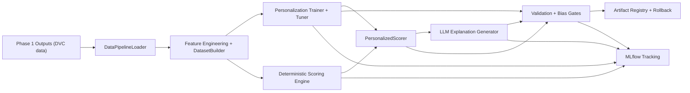

# RewardSense Phase 2 Experiment Report (Story 8.2)

Report date: 2026-03-24

## 1. Scope

This report summarizes model experimentation and validation across:

- deterministic scoring
- personalization model
- LLM explainability
- sensitivity analysis (SHAP/LIME + hyperparameter importance)
- bias detection and mitigation workflows

## 2. Architecture Diagram



## 3. MLflow Dashboards

- Cloud tracking UI: <https://mlflow-server-760934308287.us-central1.run.app>
- Local tracking UI (docker compose): <http://localhost:5001>

Experiments used:

- `reward-scoring`
- `personalization-point-valuation`
- `llm-explainability`

## 4. Key Runs

| Date (UTC) | Experiment | Run Name | Run ID | Notes |
|---|---|---|---|---|
| 2026-03-23 | `Default` | `cloudrun-persistence-verify-20260323` | `ffda1800bb634b50885f65cec807b1c6` | Cloud Run persistence probe |
| 2026-03-24 | `personalization-point-valuation` | `xgboost` | `<record-run-id>` | candidate personalization model |
| 2026-03-24 | `llm-explainability` | `llm-latency-single_transaction_recommendation` | `<record-run-id>` | explainability latency benchmark |

## 5. Visualizations Checklist (from MLflow artifacts)

Add/update these artifact links per release:

- Training curves / model comparison charts
- SHAP summary + dependence plots
- LIME local explanation examples
- Bias report charts (group disparity)
- Hyperparameter importance chart

Command to fetch latest run IDs and artifact URIs:

```bash
python - <<'PY'
import mlflow
mlflow.set_tracking_uri('https://mlflow-server-760934308287.us-central1.run.app')
for exp_name in ['reward-scoring','personalization-point-valuation','llm-explainability']:
    exp = mlflow.get_experiment_by_name(exp_name)
    if not exp:
        continue
    runs = mlflow.search_runs([exp.experiment_id], order_by=['start_time DESC'], max_results=5)
    print('\n===', exp_name, '===')
    print(runs[['run_id','artifact_uri','tags.mlflow.runName','start_time']])
PY
```

## 6. Findings Summary

- Scoring engine is deterministic with golden/regression test coverage and throughput benchmarks.
- Personalization model training/tuning/evaluation flow is operational with MLflow logging hooks.
- LLM explainability includes prompt templates, response parsing, quality filters, and fallback generation.
- Bias tooling is implemented for slice-based fairness analysis and mitigation experiments.

## 7. Known Gaps / Follow-ups

- Keep run ID table current each release.
- Attach immutable visualization links/screenshots for Expo deliverable.
- Maintain quality gate evidence from CI audit output.
